# 🧠 WriteWiseAI - AI Writing Assistant

<div align="center">


[](https://python.org)
[](https://gradio.app)
[](https://huggingface.co)
[](LICENSE)

*Transform your writing with the power of AI* ✨

[🚀 Quick Start](#-quick-start) • [✨ Features](#-features) • [📖 Documentation](#-usage)

</div>

---

## 🎯 What is WriteWiseAI?

WriteWiseAI is a **powerful AI-powered writing assistant** that helps you:
- ✅ **Fix grammar errors** instantly
- 🎨 **Improve writing style** and readability  
- 💡 **Generate creative content** from simple prompts
- ⚡ **Boost productivity** with AI-powered suggestions

Perfect for students, writers, professionals, and anyone who wants to enhance their writing!

---

## ✨ Features

<table>
<tr>
<td width="33%" align="center">

### 🔧 Grammar Correction


Automatically detect and fix:
- Spelling mistakes
- Grammar errors
- Punctuation issues
- Sentence structure

</td>
<td width="33%" align="center">

### 🎨 Style Improvement


Transform your writing:
- Better readability
- Professional tone
- Varied sentence structure
- Enhanced clarity

</td>
<td width="33%" align="center">

### 💡 Content Generation


Create fresh content:
- Blog posts
- Articles
- Creative writing
- Professional emails

</td>
</tr>
</table>

---

## 🚀 Quick Start

### Prerequisites
- Python 3.8 or higher
- Internet connection for model downloads

### Installation

1. **Clone the repository**
   ```bash
   git clone https://github.com/MahmoudAbuAwd/WriteWiseAI.git
   cd WriteWiseAI
   ```

2. **Install dependencies**
   ```bash
   pip install -r requirements.txt
   ```

3. **Launch the application**
   ```bash
   python Gradio-App/app.py
   ```

4. **Open your browser** and navigate to the local URL (usually `http://localhost:7860`)

> **🎉 That's it!** Your AI writing assistant is now ready to use.

---

## 📖 Usage

### Step-by-Step Guide

```mermaid
graph LR
    A[📝 Enter Text] --> B[🎯 Select Task]
    B --> C[✨ Click Submit]
    C --> D[🎊 Get Results]
    
    style A fill:#e1f5fe
    style B fill:#f3e5f5
    style C fill:#e8f5e8
    style D fill:#fff3e0
```



1. **📝 Input Your Text**
   - Paste or type your text in the input box
   - No length limits - write as much as you need!

2. **🎯 Choose Your Task**
   - **Grammar Correction**: Fix errors and typos
   - **Style Improvement**: Enhance readability and flow
   - **Content Generation**: Create new content from prompts

3. **✨ Submit & Enjoy**
   - Click the submit button
   - Watch AI transform your text in seconds!

### Example Transformations

<details>
<summary>🔧 Grammar Correction Example</summary>

**Input:** `I are going to the store and buy some apple's for the party.`

**Output:** `I am going to the store and will buy some apples for the party.`

</details>

<details>
<summary>🎨 Style Improvement Example</summary>

**Input:** `The meeting was good. We talked about stuff. It was productive.`

**Output:** `The meeting proved highly effective, featuring comprehensive discussions on key topics that led to productive outcomes and actionable insights.`

</details>

<details>
<summary>💡 Content Generation Example</summary>

**Prompt:** `Write about the benefits of reading books`

**Output:** `Reading books offers numerous advantages that enrich both mind and soul. Regular reading enhances vocabulary, improves cognitive function, and provides stress relief while expanding knowledge across diverse subjects...`

</details>

---

## 🤖 AI Models

Our carefully selected models power different aspects of WriteWiseAI:

| Feature | Model | Purpose |
|---------|-------|---------|
| 🔧 **Grammar** | `prithivida/grammar_error_correcter_v1` | Advanced grammar error detection and correction |
| 🎨 **Style** | `tuner007/pegasus_paraphrase` | Intelligent text paraphrasing and style enhancement |
| 💡 **Generation** | `google/flan-t5-base` | Creative content generation and completion |

---

## 🛠️ Project Structure

```
WriteWiseAI/
├── Gradio_App/
│   └── app.py                    # Main entry point for the Gradio UI
│
├── models/
│   ├── generate.py               # Logic for text generation
│   ├── grammar.py                # Grammar correction module
│   └── style.py                  # Optional: Text styling or enhancement logic
│
├── .gitignore                  # Git ignore file
├── .python-version             # Python version for environment consistency
├── readme.md                   # Project overview and documentation
└── requirements.txt            # List of dependencies
└── LICENCE                     # MIT License
```

---

---

## 🚀 Deployment

### Local Development
```bash
python Gradio-App/app.py
```

### Docker (Coming Soon)
```bash
docker build -t writewise-ai .
docker run -p 7860:7860 writewise-ai
```

### Hugging Face Spaces
Deploy directly to Hugging Face Spaces for free hosting!

---

## 📝 License

This project is licensed under the **MIT License** - see the [LICENSE](LICENSE) file for details.

```
MIT License - Feel free to use, modify, and distribute! 🎉
```

---

## 🙏 Acknowledgments

- **Hugging Face** 🤗 for providing amazing AI models
- **Gradio** 🎨 for the beautiful and simple interface framework
- **Open Source Community** 🌍 for inspiration and support

---

## 📞 Support & Contact

<div align="center">

**Need help or have questions?**

[](https://github.com/MahmoudAbuAwd/WriteWiseAI/issues)
[](mailto:mahmoodabuawad08@example.com)

---

Made with ❤️ by [MahmoudAbuAwd](https://github.com/MahmoudAbuAwd)

</div>
